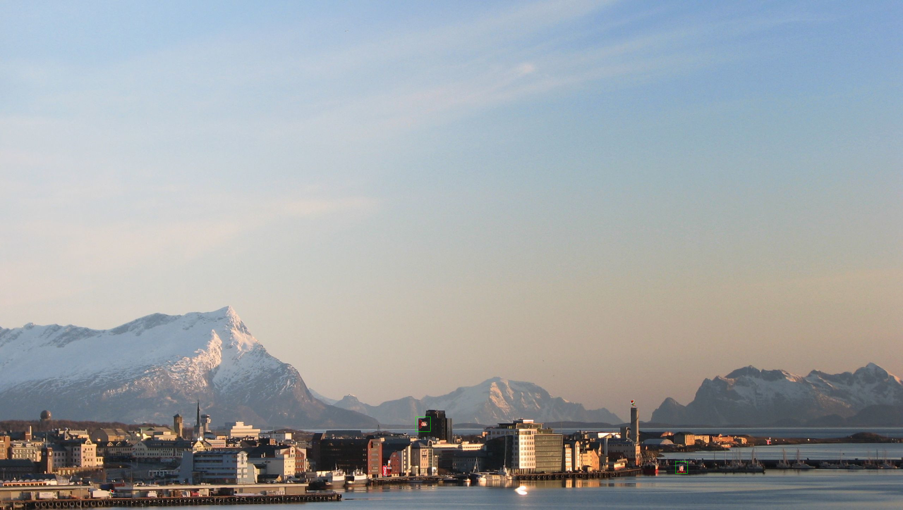
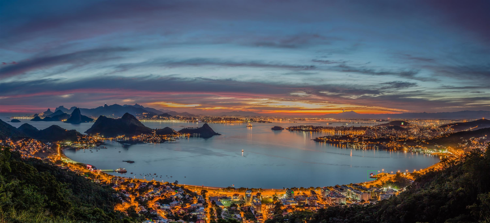

# Large-Images-Template-Matching
Finding template photos on large scale images
The aim of this project is to find a template image hidden on sample photos of high resolution.
## Template
The template used is a .png image created using this script: https://github.com/Ramosa5/Simple-Object-Finding


## How it works

Sample pixels are taken from the template and a match in color between image and template is checked. If a match in color is found an order of pixels is checked. If both conditions are fulfilled the template is found and dimensions of a bounding box are passed further.

```python
#Color match
                buff = one_det_buf+two_det_buf+three_det_buf
#Checking both conditions
                if buff==13 and (i_buf<i2_buf<i3_buf or i3_buf<i2_buf<i_buf or j_buf<j2_buf<j3_buf or j3_buf<j2_buf<j_buf):
                    found = True
#Bounding box dimensions
                    if np.abs(high1-low1) > np.abs(high2-low2):
                        boundings.append((high1, low1, mid1, mid2))
                    else:
                        boundings.append((high2, low2, mid1, mid2))
                    second_ver.append(box)
                    print(i, j)
                    break
                if w_buf > 0:
                    w_buf -= 1
```

## Outputs
A few examples of outputs computed. On each photo there are two templates to be found.




A thing to notice is bounding boxes are not always accurate depending on size of the template put on an image.



